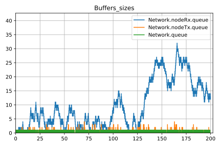
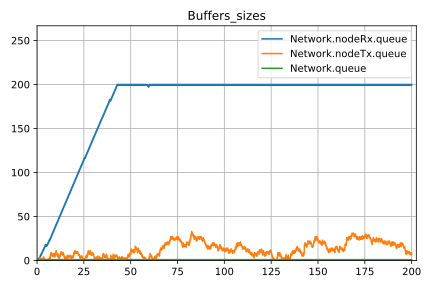
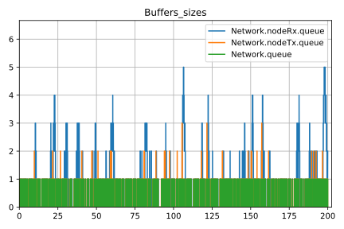
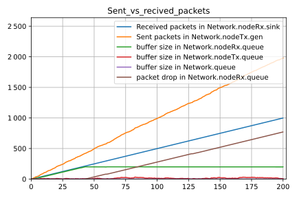
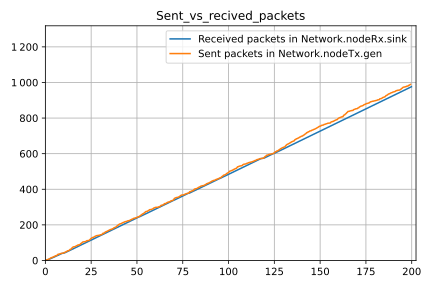
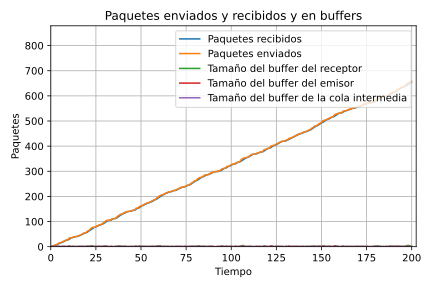
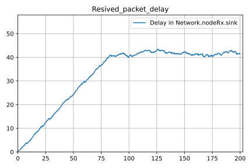
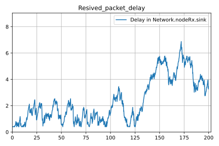
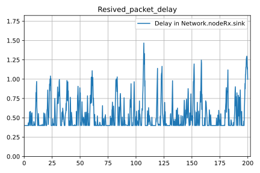

# Simulación de un productor consumidor a través de un una red simple en omnet++

#### Resumen:

    En este trabajo hicimos simulaciones de productor consumidor a través de una red que solo cuenta con un buffer intermedio, pero que se puede llenar y perder paquetes.

    En la primera parte hicimos mediciones sin tener ningún algoritmo de control de flujo y congestión y en la segunda parte implementamos un algoritmo simple de control de flujo y congestión.

#### Autores:

- Fuentes, Tiffany
- Renison, Iván
- Schachner, Álvaro

## Índice

## Introducción

    En este trabajo analizarnos una red muy simple que consta de un generador y un receptor conectados por una nodo intermedio que tiene un buffer. El esquema de esta red sería así:

    Aquí `nodeTx` es el generador y `nodeRx` es el receptor. Los canales que conectan a `nodeTx` con la cola y a la cola con `nodeRx` tienen una cantidad máxima de bits por segundo que se pueden mandar y un tiempo que se demora en llegar la información (que puede ser distinta en cada uno).

#### `nodeTx`:

    `nodeTx` tiene dos componentes, un generador, que sería como la capa de aplicación y una cola que sería como la capa de trasporte.

    El generador lo que hace es simplemente generar paquetes cada una cantidad de tiempo aleatoria según alguna distribución.

    La cola se encarga de ir mandando los paquetes a medida que va pudiendo y cuando no puede los almacena en un buffer hasta que puede mandarlos.

#### `nodeRx`:

    `nodeRx` también tiene dos componentes, un consumidor, que sería como la capa de aplicación y una cola que sería como la capa de trasporte.

    El consumidor lo que hace es consumir los paquetes a una cierta velocidad fija.

    La cola se encarga de recibir los paquetes y almacenarlos en un buffer hasta que el consumidor los consuma y que si se llena, descarta los nuevos paquetes que llegan y no entran.

#### La cola intermedia:

    La cola intermedia es simplemente como un router, que recibe mensajes de una de su entrada y los envía a la salida a medida que va pudiendo.

    Cuenta con un buffer para almacenar los paquetes cuando le llegan a mas velocidad de la que los puede mandar y que cuando se llena, la cola descarta los nuevos paquetes que van llegando.

### Variables

    Con todo eso, queda una gran cantidad de variables en el sistema. A continuación una lista de las variables mas importante:

- Intervalo de generación: distribución del tiempo de cada cuanto se genera un paquete nuevo.

- Velocidad de consumo: La velocidad máxima a la que el consumidor puede consumir los paquetes.

- Capacidad de los links: la cantidad de paquetes por segundo que pueden pasar por cada uno de estos los links (de `nodeTx` a queue y de queue a `nodeRx`) (son variables distintas). En la simulación en si se pone como cantidad de bits por segundo, pero lo que importa es la cantidad de paquetes por segundo (el tamaño del paquete también se puede definir).

- Capacidad de los buffers: La cantidad de paquetes que puede haber en los distintos buffers. Hay tres buffers en total, el que está en `nodeTx`, el de la cola del medio y el de `nodeRx`, sin embargo, el buffer de `nodeTx` lo vamos a hacer infinito y así solo son limitantes los otros dos buffers.

    También hay algunas otras variables, como el tiempo de procesamiento de los paquetes o velocidad de propagación, a las cuales no les vamos a dar mucha importancia.

### Experimentos

    Para hacer algunos experimentos, primer fijamos algunas variables:

- Al tamaño del buffer de la cola del medio y al tamaño del buffer de `nodeRx` los fijamos en 200 paquetes.

- A la capacidad del canal entre `nodeTx` y la cola del medio la fijamos en 10 paquetes por segundo.

    Y a otros parámetros los hicimos variar:

- Con las capacidad del canal entre la cola del medio y `nodeRx` y la velocidad de consumo hicimos dos casos:
  
      En el primer caso, la capacidad del canal entre la cola del medio y `nodeRx` es 10 paquetes por segundo y la velocidad de consumo 5 paquetes por segundo.
  
      En el segundo caso, la capacidad del canal entre la cola del medio y `nodeRx` es 5 paquetes por segundo y la velocidad de consumo 10 paquetes por segundo.

- Al intervalo de generación le asignamos una distribución ε(λ) (exponencial de media λ) con λ variando entre 0 y 1.

    Al hacer estos experimentos tomamos varias mediciones:

- Medimos la cantidad de paquetes generados por el generador, recibidos por el consumidor y descartados en las colas.

- Medimos la cantidad de paquetes en cada buffer en cada momento.

- Medimos la demora entre que un paquete se genera y que se recibe para cada paquete que se recibe.

    A continuación, los gráficos de paquetes en cada buffer para cada caso para un intervalo de generación de paquetes de distribución ε(0.2):

| Caso 1                                                                                        | Caso 2                                                                                        |
| --------------------------------------------------------------------------------------------- | --------------------------------------------------------------------------------------------- |
|  |  |

    Se puede ver que estos dos gráficos son muy parecidos. La principal diferencia que tienen es que el buffer de la cola del medio y el buffer del consumidor están intercambiados. Esto posiblemente se deba a que los casos son análogos, siendo la diferencia entre ellos, que en el primero el cuello de botella es la velocidad de consumo y en el segundo es la velocidad de trasmisión entre la cola del medio y el consumidor.

    Los gráficos de los paquetes enviados recibidos y descartados y de retraso son también prácticamente iguales para ambos casos, así que a partir vamos a analizar un poco mas solo los gráficos del caso 1.

    A continuación los gráficos de las tres cosas medidas para λ = 0.1, 0.2, 0.3:

| λ = 0.1                                                                                                           | λ = 0.2                                                                                                           | λ = 0.3                                                                                                           |
| ----------------------------------------------------------------------------------------------------------------- | ----------------------------------------------------------------------------------------------------------------- | ----------------------------------------------------------------------------------------------------------------- |
|                      |                      |                      |
|  |  |  |
|        |        |        |

    El motivo porque el cuál elegimos los valores 0.1, 0.2 y 0.3 es que en 0.1 la limitante principal ya es la salida del generador y al achicarlo mas se vuelve aun mas notorio eso y en 0.3 la red ya se llegan a enviar bien todos los paquetes y aumentarlo mas solo hace que esté mas sobrada la red.

    

## Métodos

## Resultados

## Discusión
