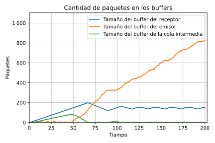
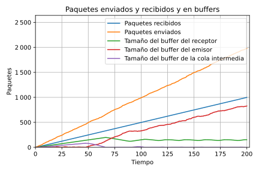
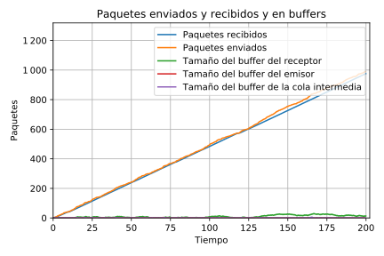
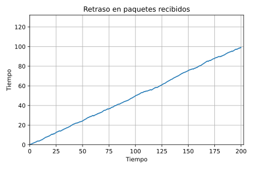
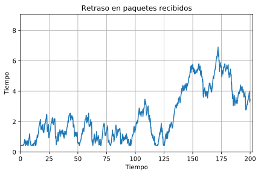
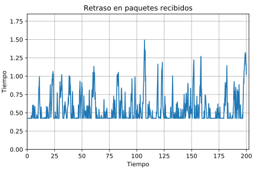

# Simulación de un productor consumidor a través de un una red simple en omnet++

#### Resumen:

    En este trabajo hicimos simulaciones de productor consumidor a través de una red que solo cuenta con un buffer intermedio, pero que se puede llenar y perder paquetes.

    En la primera parte hicimos mediciones sin tener ningún algoritmo de control de flujo y congestión y en la segunda parte implementamos un algoritmo simple de control de flujo y congestión.

#### Autores:

- Fuentes, Tiffany
- Renison, Iván
- Schachner, Álvaro

## Índice

## Introducción

    En este trabajo analizarnos una red muy simple que consta de un generador y un receptor conectados por un nodo intermedio que tiene un buffer. El esquema de esta red sería así:

    Aquí `nodeTx` es el generador y `nodeRx` es el receptor. Los canales que conectan a `nodeTx` con la cola y a la cola con `nodeRx` tienen una cantidad máxima de bits por segundo que se pueden mandar y un tiempo que se demora en llegar la información (que puede ser distinta en cada uno).

#### `nodeTx`:

    `nodeTx` tiene dos componentes, un generador, que sería como la capa de aplicación y una cola que sería como la capa de transporte.

    El generador lo que hace es simplemente generar paquetes cada cierta cantidad de tiempo aleatoria según alguna distribución.

    La cola se encarga de ir mandando los paquetes a medida que va pudiendo y cuando no puede los almacena en un buffer hasta que puede mandarlos.

#### `nodeRx`:

    `nodeRx` también tiene dos componentes, un consumidor, que sería como la capa de aplicación y una cola que sería como la capa de transporte.

    El consumidor lo que hace es consumir los paquetes a una cierta velocidad fija.

    La cola se encarga de recibir los paquetes y almacenarlos en un buffer hasta que el consumidor los consuma y que si se llena, descarta los nuevos paquetes que llegan y no entran.

#### La cola intermedia:

    La cola intermedia es simplemente como un router, que recibe mensajes de una de su entrada y los envía a la salida a medida que va pudiendo.

    Cuenta con un buffer para almacenar los paquetes cuando le llegan a más velocidad de la que los puede mandar y que cuando se llena, la cola descarta los nuevos paquetes que van llegando.

### Variables

    Con todo eso, queda una gran cantidad de variables en el sistema. A continuación una lista de las variables mas importante:

- Intervalo de generación: distribución del tiempo de cada cuanto se genera un paquete nuevo.

- Velocidad de consumo: La velocidad máxima a la que el consumidor puede consumir los paquetes.

- Capacidad de los links: la cantidad de datos por segundo que pueden pasar por cada uno de estos los links (de `nodeTx` a queue y de queue a `nodeRx`) (son variables distintas). En la simulación en sí se pone como cantidad de bits por segundo, pero lo que importa es la cantidad de paquetes por segundo (el tamaño del paquete también se puede definir).

- Capacidad de los buffers: La cantidad de paquetes que puede haber en los distintos buffers. Hay tres buffers en total, el que está en `nodeTx`, el de la cola del medio y el de `nodeRx`, sin embargo, el buffer de `nodeTx` lo vamos a hacer infinito y así solo son limitantes los otros dos buffers.

    También hay algunas otras variables, como el tiempo de procesamiento de los paquetes o velocidad de propagación, a las cuales no les vamos a dar mucha importancia.

### Experimentos

    Para hacer algunos experimentos, primer fijamos algunas variables:

- Al tamaño del buffer de la cola del medio y al tamaño del buffer de `nodeRx` los fijamos en 200 paquetes.

- El tamaño de los paquetes que se envían es de 12500 bytes.

- A la capacidad del canal entre `nodeTx` y la cola del medio la fijamos en 1Mb/s

    Y a otros parámetros los hicimos variar:

- Con las capacidad del canal entre la cola del medio y `nodeRx` y la velocidad de consumo hicimos dos casos:

      En el primer caso, la capacidad del canal entre la cola del medio y `nodeRx` es 1Mb/s y la velocidad de consumo del receptor es de 0.5Mb/s.

      En el segundo caso, la capacidad del canal entre la cola del medio y `nodeRx` es 0.5Mb/s y la velocidad de consumo del receptor es de 1Mb/s.

- Al intervalo de generación le asignamos una distribución ε(λ) (exponencial de media λ) con λ variando entre 0 y 1.

    Al hacer estos experimentos tomamos varias mediciones:

- Medimos la cantidad de paquetes generados por el generador, recibidos por el consumidor y descartados en las colas.

- Medimos la cantidad de paquetes en cada buffer en cada momento.

- Medimos la demora entre que un paquete se genera y que se recibe para cada paquete que se recibe.

    A continuación, los gráficos de paquetes en cada buffer para cada caso para un intervalo de generación de paquetes de distribución ε(0.2):

| Caso 1                                                                                        | Caso 2                                                                                        |
| --------------------------------------------------------------------------------------------- | --------------------------------------------------------------------------------------------- |
|  |  |

    Se puede ver que estos dos gráficos son muy parecidos. La principal diferencia que tienen es que el buffer de la cola del medio y el buffer del consumidor están intercambiados. Esto posiblemente se deba a que los casos son análogos, siendo la diferencia entre ellos, que en el primero el cuello de botella es la velocidad de consumo en el receptor y en el segundo es la velocidad de trasmisión entre la cola del medio y el consumidor.

    Los gráficos de los paquetes enviados recibidos y descartados y de retraso son también prácticamente iguales para ambos casos, así que a partir vamos a analizar un poco mas solo los gráficos del caso 1.

    A continuación los gráficos de las tres cosas medidas para λ = 0.1, 0.2, 0.3:

| λ = 0.1                                                                                                           | λ = 0.2                                                                                                           | λ = 0.3                                                                                                           |
| ----------------------------------------------------------------------------------------------------------------- | ----------------------------------------------------------------------------------------------------------------- | ----------------------------------------------------------------------------------------------------------------- |
|                      |                      |                      |
|  |  |  |
|        |        |        |

    El motivo porque el cuál elegimos los valores 0.1, 0.2 y 0.3 es que en 0.1 la limitante principal ya es la salida del generador y al achicarlo mas se vuelve aun más notorio eso y en 0.3 la red ya se llegan a enviar bien todos los paquetes y aumentarlo más solo hace que esté mas sobrada la red.

    Esto se puede ver mejor en gráficos que comparen los paquetes enviados, recibidos y el intervalo de generación.

    El siguiente gráfico compara la cantidad de paquetes enviados con respecto a la cantidad de paquetes recibidos por segundo (la cantidad de paquetes enviados aumenta cuando disminuye el intervalo de generación).

    Y este gráfico es de la proporción de paquetes que llegan según el intervalo de generación.

    En ambos gráficos se puede ver como aumentar el intervalo de generación hace que la cantidad de paquetes enviados y recibidos sea casi igual, mientras que cuando se disminuye es mayor la diferencia.

## Métodos

    Surgieron varias formas para solucionar la pérdida de paquetes por problemas de flujo (buffer del receptor lleno) y de congestión (buffer en la red intermedia lleno). Algunas aproximaciones que tuvimos en cuenta fueron:

1. Se envía un paquete y se espera hasta que el receptor envíe una confirmación de que le llegó el paquete, es muy parecido al algoritmo de parada y espera. El problema principal que conlleva este método es que no se alcanza a aprovechar la capacidad de subida del canal.

2. Es una clase de evolución al primer método, esta vez se envían paquetes continuamente hasta que algún buffer intermedio esté (casi) lleno, cuando esto suceda se enviará una señal que hará que el emisor pare de enviar paquetes.

3. Este último método, el que terminamos implementando, es una mejora del segundo, consiste en más o menos lo mismo, lo que cambia es la parte de cuando un buffer está casi lleno (establecemos una variable "umbral" dependiente del nodo para determinar que significa que esté casi lleno) se envía una señal (tanto desde la queue intermedia como desde el receptor) que en el lado del emisor retrasa la transmisión de paquetes (en lugar de pararla completamente).

## Resultados

Para poder evaluar los resultados del algoritmo, al ser la misma solución tanto para un problema de congestión y un problema de flujo, modificamos los siguientes valores para que se pudieran observar ambos problemas en una sola simulación:

- La tasa de transferencia desde el emisor al enrutador es de 1Mb/s.

- La tasa de transferencia del enrutador al receptor es de 0.8Mb/s, además el tamaño del buffer pasa de 200 a 100.

- La velocidad de consumo del emisor (velocidad con que los paquetes pasan de la cola a la aplicación) es de 0.5Mb/s.

De esta manera aseguramos que en algún momento se va a llenar el buffer de el router ya que la tasa de transmisión del emisor al mismo es más rapida que el procesamiento en el router, y también habra un problema de control de flujo ya que el emisor recibe paquetes más rápido de lo que los procesa.

A continuación, el gráfico de paquetes en cada buffer para un intervalo de generación de paquetes de distribución ε(0.1):

Se puede observar claramente en ambos casos que cada vez que la cola se acerca a su tamaño máximo y se envía el paquete de advertencia al emisor baja considerablemente la tasa de transmisión lo que causa que las colas logren descongestionarse. Además se puede ver que despues de cierto tiempo se va llenando la cola nuevamente, esto debido a que después de que pasa cierto tiempo sin recibir un paquete de advertencia el emisor aumenta la tasa de transferencia.

Viendo el gráfico se puede ver que en los casos de congestión es bastante parecido a los algoritmos de control de congestión que maneja TCP, el motivo por el que lo hicimos de esta manera y porque baja tanto la tasa de transmisión es para asegurar que se baje lo suficiente como para prevenir la pérdida de paquetes.

Otra cosa que se puede observar claramente además de la variación de la cantidad de paquetes en cola es la cantidad de paquetes que quedan en la cola del emisor, esto debido a que con un intervalo de generación de 0.1 los paquetes se generan muy rápido comparado a la tasa de transmisión del emisor al enrutador, y se va a ver reflejado más adelante en los gráficos de carga enviada vs carga recibida.

A continuación podemos observar el gráfico de paquetes recibidos, enviados, y pérdidos a lo largo de la simulación, el estado de los búffers en cada simulación, y el delay para λ = 0.1, 0.2, 0.3:

| λ = 0.1                                                                                                           | λ = 0.2                                                                                                           | λ = 0.3                                                                                                           |
| ----------------------------------------------------------------------------------------------------------------- | ----------------------------------------------------------------------------------------------------------------- | ----------------------------------------------------------------------------------------------------------------- |
|                      |                      |                      |
|  |  |  |
|        |        |        |

Podemos observar que cuando el intervalo es mayor o igual a 0.2 los gráficos son muy parecidos a los que vimos en el segmento anterior (sin algoritmo de control de congestión/flujo), esto debido a que para el intervalo de generación de paquetes las tasas de transmisión son lo suficientemente altas como para evitar congestiones o problemas de flujo.

El caso más interesante es cuando el intervalo es igual a 0.1, anteriormente vimos que en este caso la mayoría de paquetes quedan en la cola del emisor debido a la velocidad de la tasa de transferencia, y esto se puede ver en el gráfico de paquetes enviados vs recibidos, ya que parece que sólo se recibe la mitad de los paquetes que se envían, sin embargo esto no se debe a que se pierdan paquetes, ya que en el gráfico se puede ver que no hay paquetes perdidos, se debe a los paquetes que quedan en las colas (la gran mayoría en la cola del emsior). Otra cosa que se puede observar en este caso es como el delay va aumentando constantemente, esto debido a que constantemente se esta bajando la velocidad de transmisión de paquetes en el emisor para evitar la congestión en el enrutador del medio y en la cola del receptor.

A continuación podemos observar los gráficos de carga enviada vs carga recibida y de paquetes enviados/recibidos por intervalo:

Como comentamos anteriormente, a primera vista se puede ver que son muy parecidos a los gráficos obtenidos en el segmento anterior, donde no hay algoritmo de control de congestión/flujo, sin embargo en el análisis que hicimos anteriormente para el intervalo de 0.1 pudimos observar que cuando los paquetes se generan muy rápido, debido a la baja velocidad de transmisión la mayoría queda en la cola del emisor que es bastante grande, sin embargo no se pierden paquetes a lo largo de la red.

## Discusión
